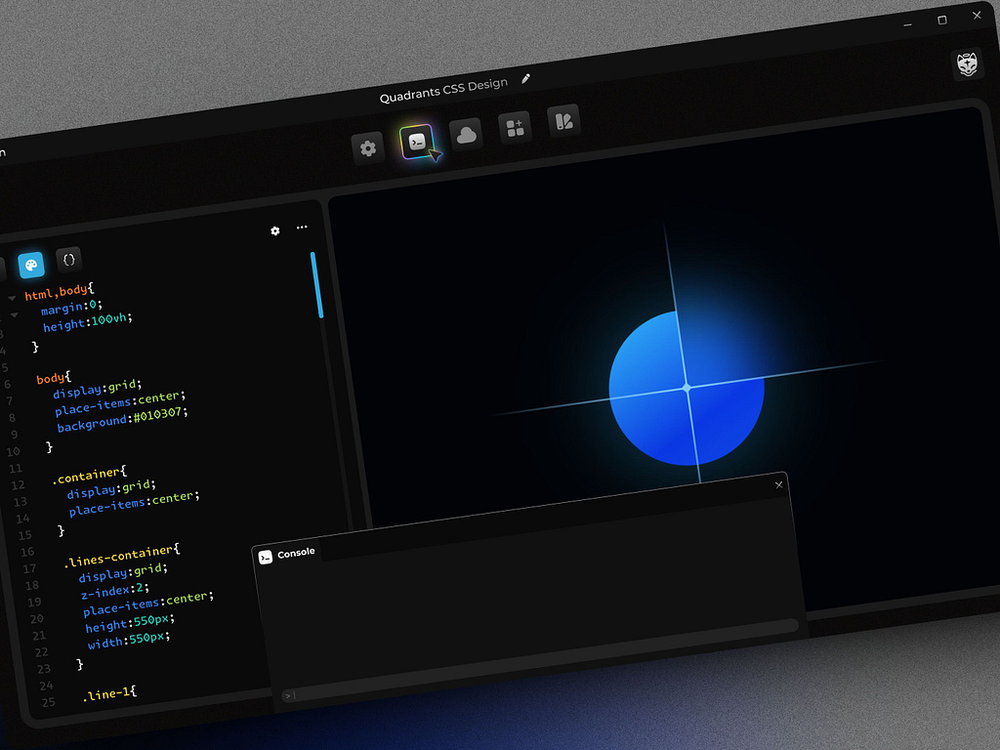
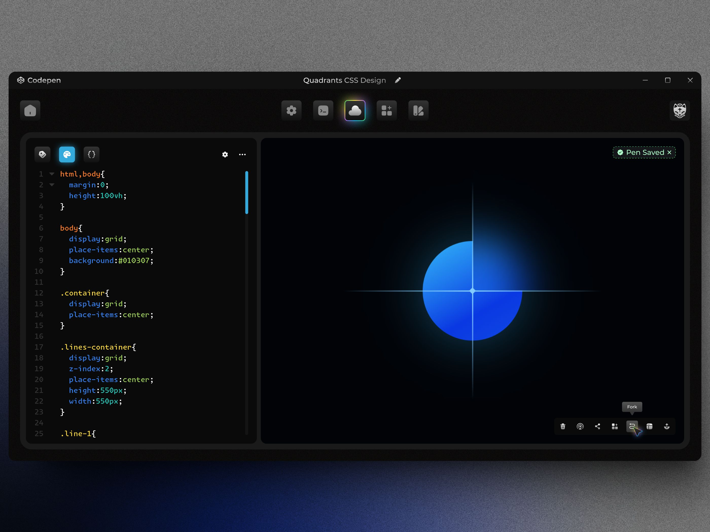

<a href="https://dribbble.com/shots/25090422-Codepen-Concept-Design">
  
</a>

# ✨ Codepen Concept Design

Este repositorio contiene el desarrollo de un concepto visual experimental inspirado en [Codepen](https://codepen.io/), basado en el diseño original de [**BlurSoul en Dribbble**](https://dribbble.com/BlurSoul) titulado **Codepen Concept Design**. El objetivo principal de este proyecto es recrear y adaptar una propuesta visual moderna y minimalista para la interfaz de Codepen, explorando nuevas formas de interacción y presentación de código en la web.

## 📷 Captura de Pantalla

[](https://dribbble.com/shots/25090422-Codepen-Concept-Design)

Enlace del diseño:
https://dribbble.com/shots/25090422-Codepen-Concept-Design

## 🔥 Características

- 💎 **Diseño Moderno**: Inspirado en el concepto de Codepen, con un enfoque en la simplicidad y la elegancia.
- 🧑‍💻 **Interactividad**: Aunque el proyecto utiliza principalmente HTML y CSS, se han implementado algunos efectos visuales para mejorar la experiencia del usuario.
- 🌿 **Minimalista**: Utiliza un enfoque de diseño limpio, lo que permite que el contenido destaque.
- 🎨 **Paleta de colores armónica**: El diseño emplea una selección de colores coherente y agradable a la vista.

## 🚀 Stack de desarrollo

- **[Astro](https://astro.build/)**: Este proyecto está construido con Astro, un generador de sitios estáticos que permite crear aplicaciones web rápidas y eficientes.
- **[HTML](https://lenguajehtml.com/html/) y [CSS](https://lenguajecss.com/css/)**: El diseño esencial se basa en HTML y CSS, utilizando técnicas modernas de diseño web.
- **[TypeScript](https://www.typescriptlang.org/)**: Utilizado para mejorar la experiencia de desarrollo.
- **[Firebase](https://firebase.google.com/)**: Este proyecto se despliega automáticamente con [GitHub Actions](https://github.com/features/actions) y está alojado en [Firebase Hosting](https://firebase.google.com/products/hosting), lo que permite una implementación rápida y segura de aplicaciones web estáticas.

## 🌐 Soporte de navegador

| <center></center> | <center></center> | <center></center> | <center></center> |
--- | --- | --- | --- |
Latest ✅ | Latest ✅ | Latest ⚠️ | Latest ⚠️ |

- ⚠️ Firefox actualmente no soporta [`View Transitions`](https://caniuse.com/view-transitions) ni [`Anchor Positioning`](https://caniuse.com/css-anchor-positioning), por lo que algunas animaciones y funcionalidades pueden no funcionar como se espera.
- ⚠️ Safari no soporta [`Anchor Positioning`](https://caniuse.com/css-anchor-positioning), por lo que algunas funcionalidades pueden no funcionar como se espera.

## ⬇️ Desarrollo en local

1. Clona el repositorio:

```bash
git clone https://github.com/felixicaza/codepen-concept.git
```

2. Navega al directorio del proyecto:

```bash
cd codepen-concept
```

3. Instala las dependencias:

```bash
pnpm install
```

4. Inicia el servidor de desarrollo:

```bash
pnpm run dev
```

5. Abre el navegador y ve a:

```
http://localhost:4321
```

## 🤝 Contribuir

Si deseas contribuir a este proyecto, por favor lee la [Guía de Contribución](./CONTRIBUTING.md).

## 📄 Licencia

Este proyecto utiliza la Licencia MIT. Consulte el [Archivo de Licencia](./LICENCE) para obtener más información.

---

Desarrollado por [Felix Icaza](https://felixicaza.com) y [Miguel Colmenarez](https://github.com/colmedev). Diseñado por [BlurSoul](https://dribbble.com/BlurSoul).
